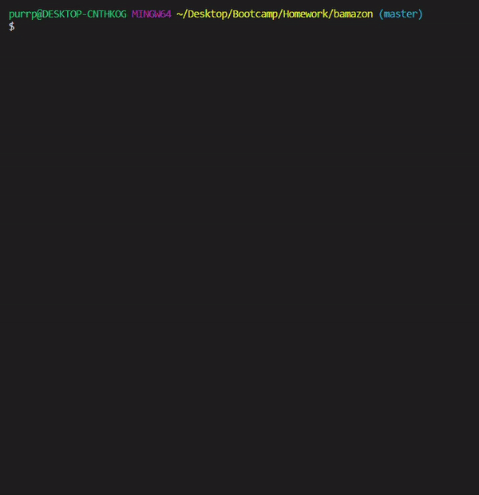
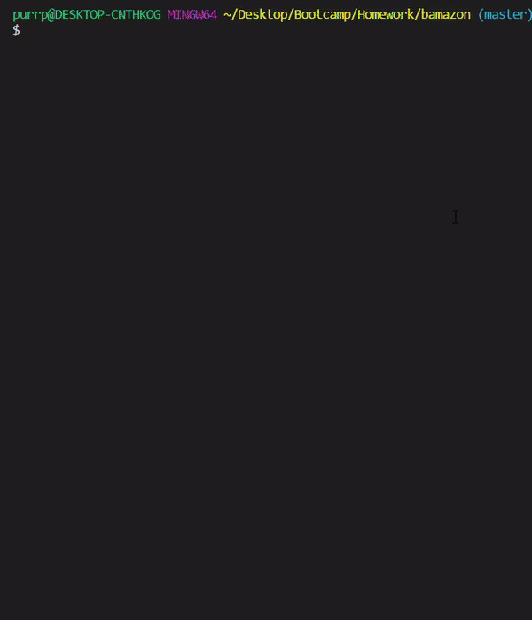
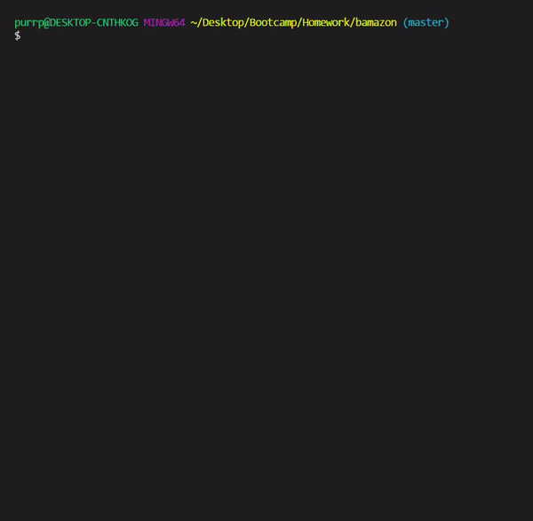

# bamazon
* This is a command line online store simulator 
* It uses a MySQL database to keep track of store items
---
### There are three modes the application can be run in
1. Customer View
    * Buy items from the store

2. Manager View
    * View all products
    * View products with a low stock quantity
    * Restock items
    * Add new items

3. Supervisor View
    * View profit from each store department
    * Add new departments

---
### To use this project
* Clone the repository
* Run `npm i` in the terminal
* Run `node bamazonCustomer.js`, `node bamazonManager.js` or `node bamazonSupervisor.js` 
---
### Tools used in this project
* [npm my-sql](https://www.npmjs.com/package/mysql)
* [npm cli-table](https://www.npmjs.com/package/cli-table)
* [npm Inquirer](https://www.npmjs.com/package/inquirer)